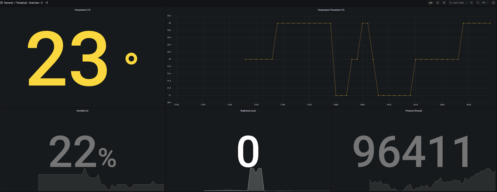

# sensorhub-prometheus-http-wrapper

- [sensorhub-prometheus-http-wrapper](#sensorhub-prometheus-http-wrapper)
  - [About](#about)
  - [Install dependencies](#install-dependencies)
  - [Run](#run)
  - [Configure as systemd service](#configure-as-systemd-service)
  - [How to continue from here](#how-to-continue-from-here)


## About 

This is a HTTP wrapper for the available metrics of the [Dockerpi Sensorhub](https://wiki.52pi.com/index.php?title=EP-0106). The goal is to use this endpoint as Prometheus scrape target and visualize the metrics on a small beautiful Grafana dashboard.

> The webserver will be exposed on port `8080`.

## Install dependencies

Run `pip3 install smbus flask`

## Run

Execute `python3 main.py`

## Configure as systemd service

Adapt the template file `sensorhub-prometheus-http-wrapper.service` and store it in the right location:

```bash
sudo nano /etc/systemd/system/sensorhub-prometheus-http-wrapper.service
#enter systemd file content
sudo systemctl --system daemon-reload
sudo systemctl enable sensorhub-prometheus-http-wrapper
sudo systemctl start sensorhub-prometheus-http-wrapper
sudo systemctl status sensorhub-prometheus-http-wrapper
```

## How to continue from here

Configure a prometheus instance to scrape the endpoint (and optionally push the metrics to Grafana Cloud using `remote_write`). A sample configuration can be found under `sample_prometheus_config.yaml`.

Visualizing all the metrics within Grafana is no biggie, also if you use the provided dashboard template in `grafana-dashboard.json`. It should look like this:


